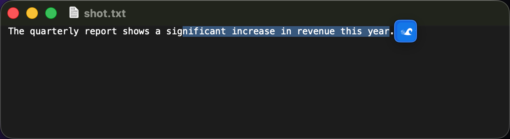

<h1 align="center">Saypick</h1>
<p align="center"><b>System-wide AI translation &amp; inline rewrite for macOS &amp; Windows</b></p>

<p align="center">
  
  
  
  
  
  
  <a href="https://discord.com/invite/eGzEaP6TzR"></a>
</p>

<p align="center">
  <a href="https://everettjf.github.io/Saypick/">🌐 Website</a> ·
  <a href="docs/blog/introducing-saypick.md">📝 Read the intro</a> ·
  <b>English</b> · <a href="README.zh-CN.md">简体中文</a>
</p>

Saypick lives in your menu bar (macOS) or system tray (Windows) and works in **any** app. Two things, one shortcut each:

- **Read** — select foreign text, hit a shortcut, and a translation pops up next to it.
- **Write** — type in your own language, hit a shortcut, and it’s **rewritten in place** into the target language, ready to send.

Translation runs through a local model (**Ollama**) for full privacy, or any **OpenAI-compatible** endpoint for speed. No browser tab, no copy-paste into a translation site — your selection stays where it is, and (with Ollama) never leaves your machine.

<p align="center">
  
  <br/><sub><i>Write · type in your language, press <kbd>⌥R</kbd>, and it’s rewritten in place.</i></sub>
</p>

<p align="center">
  
  <br/><sub><i>Read · select text and the translation streams into a popup — Copy or Replace.</i></sub>
</p>

<p align="center">
  
  <br/><sub><i>Optional floating icon appears right next to your selection.</i></sub>
</p>

---

## ✨ Features

- **Read · translate** — select text anywhere → popup with the translation. Trigger by shortcut, a floating icon next to the selection, or auto-translate on select.
- **Write · rewrite in place** — write in your native language, press the rewrite shortcut, and the input field is replaced with the translation. Replace immediately or preview first.
- **Works in every app** — uses the Accessibility API (macOS) / UI Automation (Windows) to read the selection, with a clipboard-copy fallback for Electron/web apps, so it works even where text APIs don’t. The original clipboard is always restored.
- **Undo-safe replacement** — replacements are pasted, preserving each app’s native undo stack.
- **Local or cloud** — pluggable backends: **Ollama** (offline, private) or any **OpenAI-compatible** API (`/chat/completions`, streaming). Switch in Settings.
- **Model picker** — Settings lists your installed Ollama models; if the configured model isn't installed, Saypick auto-selects one so it works out of the box. Thinking models (qwen3 family, …) are handled — hidden reasoning is disabled so translations stay instant.
- **Styles** — Faithful, Formal, Casual, or Polished, independently for read and rewrite.
- **Menu-bar / tray only** — no Dock or taskbar clutter. Global shortcuts, launch at login, per-app skip list.
- **Native on both platforms** — SwiftUI on macOS, Win32 C++ on Windows. No Electron, no runtime.

## 💡 Why Saypick

| | Saypick | Browser translate sites | OS built-in translate |
|---|---|---|---|
| Works in any app (mail, chat, IDE, terminal) | ✅ | ❌ (paste in/out) | ⚠️ menu only |
| Rewrite **in place** for replies | ✅ | ❌ | ❌ |
| Runs 100% offline / private | ✅ (Ollama) | ❌ | ⚠️ |
| Bring your own model / endpoint | ✅ | ❌ | ❌ |
| Streaming output | ✅ | ⚠️ | ❌ |

## 🌍 Languages

Detection and translation cover the 10 most-spoken languages: **English, Chinese, Hindi, Spanish, French, Arabic, Bengali, Russian, Portuguese, Indonesian.** Pick your native and foreign language in **Settings → Language**. Each shortcut (⌥D / ⌥R) has its own direction: **auto** detects the selected text's language and translates the other way, or pin a **fixed** direction for mixed-language text.

## 🚀 Quick start

**1. Pick a backend**

Local (private, offline) — install [Ollama](https://ollama.com/download), then:
```bash
# macOS: brew install ollama · Windows: winget install Ollama.Ollama
ollama pull qwen3.5:4b   # or any compact chat model that fits your hardware
ollama serve             # usually already running as a service
```
…or cloud: in **Settings → Backend**, choose *Cloud API*. Windows includes presets for
OpenAI, OpenRouter, and DeepSeek plus a custom OpenAI-compatible endpoint; API keys are
kept in Windows Credential Manager rather than the settings JSON.

Saypick lists your installed models in **Settings → Backend** and auto-picks an installed one if the configured model is missing — pulling *any* chat model is enough to get going.

**2. Install Saypick**

macOS — with [Homebrew](https://brew.sh) (recommended):
```bash
brew install --cask everettjf/saypick/saypick
```
…or download the latest `.dmg` from [Releases](../../releases), drag it to Applications, and launch it. The build is signed and notarized by Apple.

Windows — download and run the latest `Saypick-Setup-x.y.z.exe` installer from [Releases](../../releases) (per-user, no admin needed; a portable `Saypick-Windows-x.y.z.zip` is also available). If SmartScreen warns about an unrecognized app, choose **More info → Run anyway**.

**3. First run**

macOS: allow Saypick under **System Settings → Privacy & Security → Accessibility** (required to read selections and replace text). Windows needs no special permission. Then:

- Select text → **⌥D** (macOS) / **Alt+D** (Windows) → see the translation.
- Type in your language → **⌥R** / **Alt+R** → it’s rewritten in place.

Shortcuts, triggers, styles, and languages are all configurable in **Settings**.

## ⌨️ Default shortcuts

| Action | macOS | Windows |
|---|---|---|
| Translate selection (read) | <kbd>⌥</kbd><kbd>D</kbd> | <kbd>Alt</kbd><kbd>D</kbd> |
| Rewrite & replace (write) | <kbd>⌥</kbd><kbd>R</kbd> | <kbd>Alt</kbd><kbd>R</kbd> |

## 🧠 How it works

```
Select / type  ─►  Shortcut · floating icon · auto
                          │
      Capture (AX / UI Automation selection ─► clipboard fallback)
                          │
              Translate (Ollama / OpenAI-compatible, streaming)
                          │
        Read: popup  ·  Write: paste in place (undo-safe)
```

## 🏗️ Project structure

```
macos/                 # SwiftUI app (Xcode project)
├── Saypick/
│   ├── Core/          # SelectionCapture, TextReplacer, TriggerController,
│   │                  # SelectionMonitor, PopupPositioner, LaunchAtLogin, …
│   ├── Translation/   # TranslationProvider, Ollama / OpenAI providers,
│   │                  # TranslationService, cache, model resolver
│   ├── UI/            # Translation popup + floating selection icon
│   ├── Config/        # AppSettings, LanguageConfig
│   ├── Services/      # GlobalShortcutCenter, UpdateChecker, system service
│   └── Views/         # Menu bar + Settings
└── scripts/           # Release / notarization scripts

windows/               # Native Win32 C++20 app (CMake)
├── src/               # Tray, hotkeys, UIA capture, popup, providers,
│                      # settings window, replacer, language detection
└── assets/            # Icon

docs/                  # GitHub Pages site + blog + screenshots
```

## 🔨 Build & release

macOS:
```bash
cd macos
open Saypick.xcodeproj          # ⌘R to run

# Signed release + notarized DMG (configure .env from .env.template first)
./scripts/build-release.sh      # → build/Saypick.dmg
```

Requirements: macOS 26+, Xcode 15+. The app is **not** sandboxed (it needs Accessibility + synthetic key events). For local dev builds, sign with your Apple Development team so the Accessibility grant persists across rebuilds.

Windows:
```powershell
cd windows
cmake -B build -G Ninja -DCMAKE_BUILD_TYPE=Release
cmake --build build             # → build/Saypick.exe
```

Requirements: Windows 10+, Visual Studio 2022+ (MSVC, CMake, Ninja). No third-party dependencies — pure Win32 + WinHTTP + UI Automation. See [windows/README.md](windows/README.md) for architecture and the test harness.

**Releasing** — both platforms share one version (root `VERSION` file) and attach to the same GitHub release tag, in either order:

```bash
./scripts/bump-version.sh            # patch +1, syncs pbxproj / CMake / rc / manifest
# commit, then on each platform:
./scripts/release-windows.ps1        # Windows: builds installer + zip, creates/updates release
./scripts/release-macos.sh           # macOS: builds notarized DMG, creates/updates release
```

Whichever platform releases first creates the `vX.Y.Z` tag; the other uploads its asset to the same release later. Requires `gh auth login` once.

## 🔧 Troubleshooting

- **Shortcut does nothing** → macOS: confirm Accessibility is granted (Settings → General shows *Granted*) and Saypick is enabled in the menu bar. Windows: another app may own the hotkey — pick a different one in Settings → Shortcuts.
- **No translation** → Ollama: is `ollama serve` running and the model installed? (Saypick auto-picks an installed model if your configured one is missing.) OpenAI: check base URL / key / model.
- **Translation is very slow on a qwen3-class model** → Saypick disables hidden “thinking”, preloads the selected model, and keeps it warm for 10 minutes. If it still crawls, the model may be too big for your hardware — try a smaller one from **Settings → Backend**.
- **Misaligned popup in some apps** → those apps don’t expose text bounds; the popup falls back to the cursor position.
- **“Can’t be opened on this Mac” on Sequoia or earlier** → Saypick requires **macOS 26+**. It’s built against the current SwiftUI menu-bar and Settings APIs, and keeping a single modern baseline is what lets a small project stay reliable. Support for older macOS isn’t planned right now.
- **Which language goes where?** → In **Settings → Language**, pick your **native** and **foreign** language (there is no “source/target” pair to get backwards). Each shortcut has its own direction; **auto** detects the selected text and translates the other way.

## 🤝 Contributing

Issues and PRs welcome. Join the [Discord](https://discord.com/invite/eGzEaP6TzR).

## 📄 License

[MIT](LICENSE) · Made with ❤️ for macOS & Windows. If Saypick helps you, a ⭐️ is appreciated!
